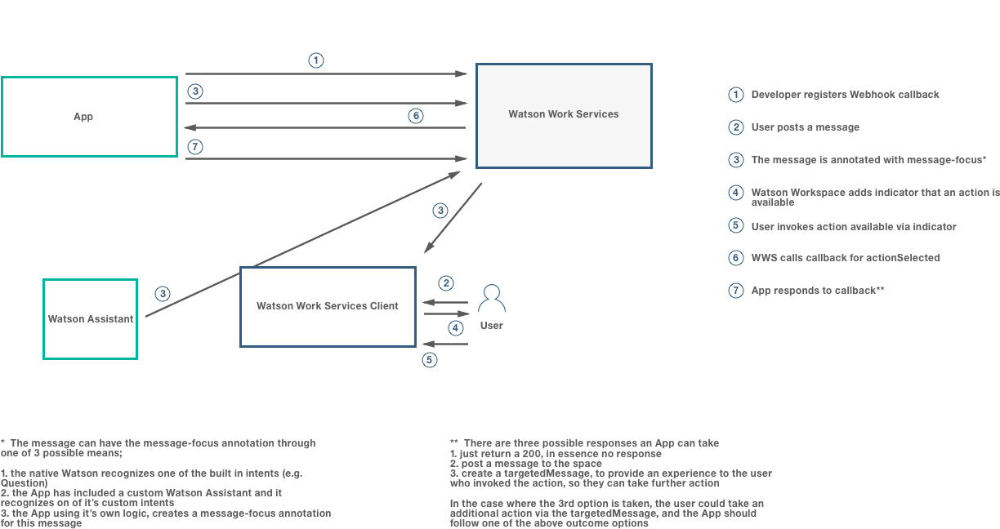
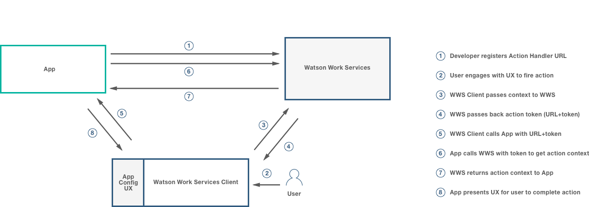
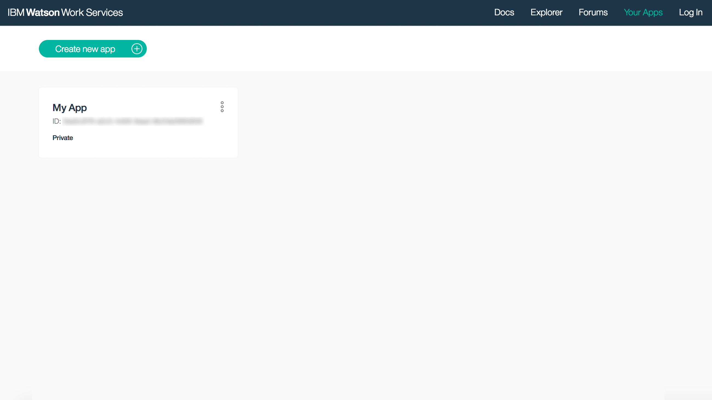
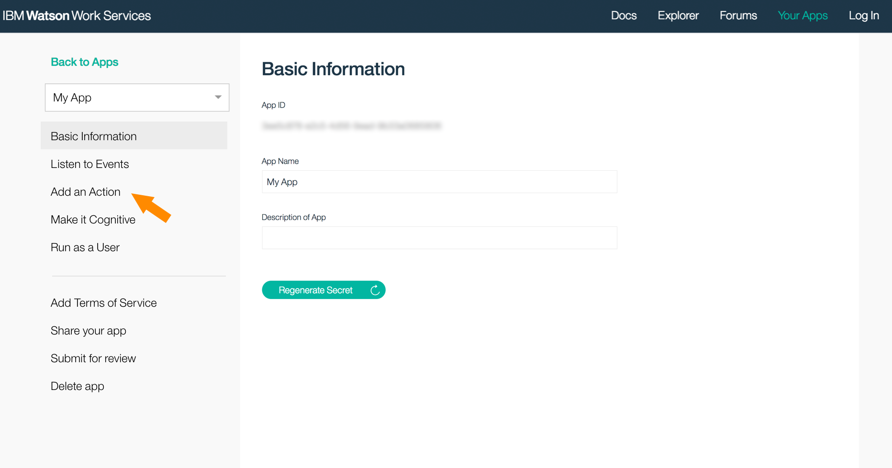
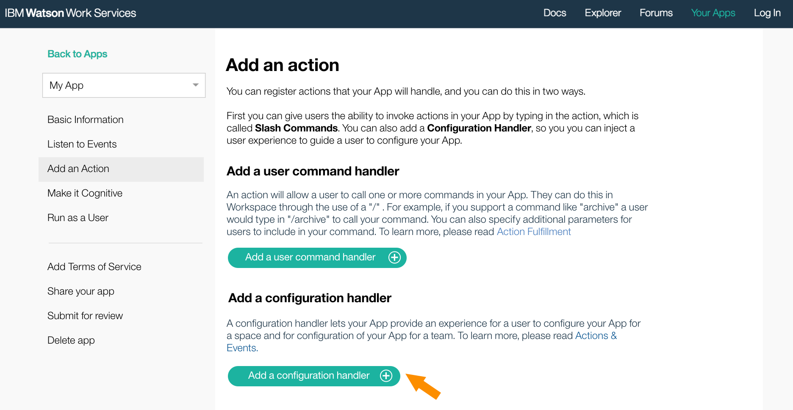
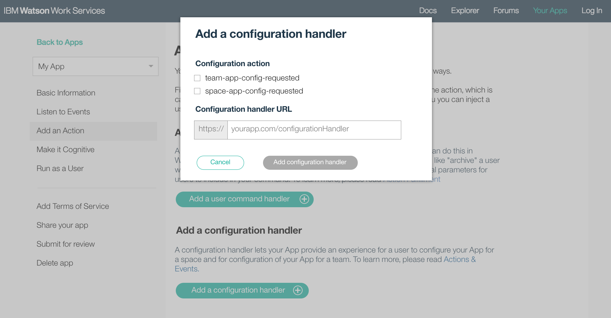
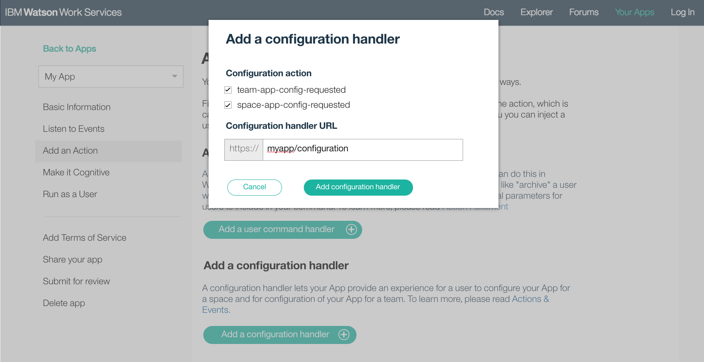
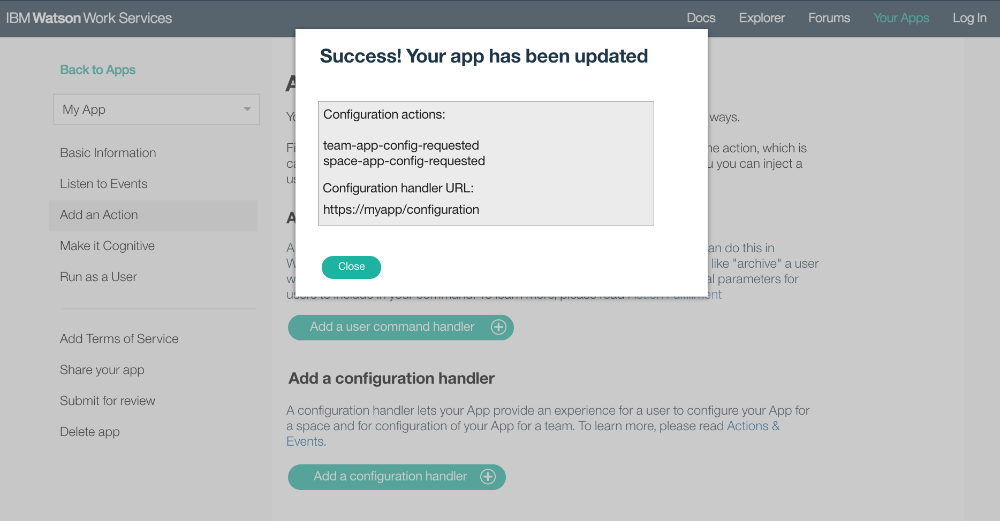
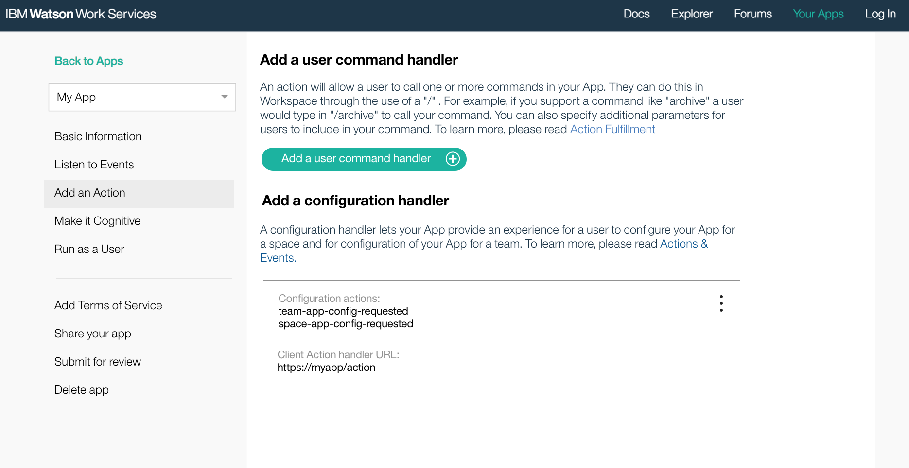
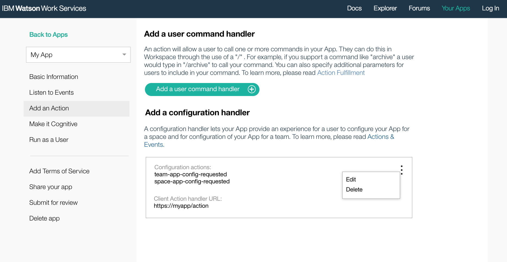

## Actions and Events

Watson Work Services gives your App two patterns for dealing with events, which take place either due to changes in the data model and/or due to actions humans take using a participating client in Watson Work Services such as the Workspace clients. One of these is called **Implicit Action Handler**, the other is called **Explicit Action Handler**.

We are standardizing patterns in our programming model and thus the existing App Configuration flow, though is being kept for backwards compatibility, is being incorporated into this new ClientActionHandler flow. It will introduce a change to how to make your app configurable. Currently, in the [Your Apps section](https://developer.watsonwork.ibm.com/apps) there is a section called **Additional Information** where you enter a configuration URL (for configuring your app in a space) and Terms of Services for your app. With this change we will move Terms of Service to it's own section, and remove the **Additional Information** section. The rest of this guide explains what you will do to set up your app to handle user actions regarding App configuration. If you had already establised an app with configuration, you will not need to do anything to continue working as is, and can update your app as needed. 

There are three main concepts to Actions

| Concept                       | Description       |
| ----------------------------- |:------------------|
| **Declare**                   | The developer will declare their app will handle an action via various constructs provided in the developer user experience such as: /Commands that trigger an Action Fulfillment experience  Cognitively detected actions from Watson Assistant training Action Fulfillment UI elements such as buttons, etc Client provided actions such as App Configuration and Sharing Resources |
| **Action Handling**           | This is the act of handling actions fired based on what the developer has declared above. |
| **Action User Experience**    | There are two approaches to handle and present a user experience to satisfy an action.   **Implicit** where a Watson Work Services client will handle the actual User Experience rendering and interaction.  **Explicit** where your app will be invoked from a Watson Work Services client to inject a User Experience via URL. |

Here you can see how these three concepts come into play via these examples:

**/Command flow**

**Cognitively detected actions flow**

 

**Client action handlers**

## Listen to Events

In our programming model we refer to Events in general, as those triggered based on changes to the data model regardless of the source of that change (ie. a human using a client, an app on a schedule, etc...). One exception is the actionSelected event which makes no changes to the data model and is referred to later in this guide.

The common theme is that typically, an app that handles these events need not present a user experience to a user and can operate in a "headless" or "no-UI needed" fashion.

Handling these events was also known as apps "listening to a conversation", but as has been established there are many other types of events.

Please read [Listen to Events](https://github.com/watsonwork/watsonwork-developer-docs/blob/master/guides/V1_wwsg_Webhooks.md) here for information on handling these types of events.

## Handling Client Actions

Watson Work Services allows your App to provide for actions issued from a Watson Work Services client (like Watson Workspace). 
Here your App will be invoked directly from the client app and can provide a user experience to guide a user through the 
fulfillment of that action. This is accomplished in one of two ways, using Commands or Client Action Handlers. 

Watson Work Services allows your App to provide handlers for user actions issued from a Watson Work Services client (like Watson Workspace). User actions can be classified as:

1. User actions which can be handled by an app with an indirect user experience where the app developer declares simpler UI constructs for the Watson Work services client to then generate UI and present to the user. Example: /commands
2. User actions which can be handled by an app providing a direct user experience where the app developer codes client specific UI. Here your App will be invoked directly from the Watson Work Services client (such as Workspace) and it can provide a user experience to guide a user through the fulfillment of that action. Example: App Configuration

### Implicit Action Handler

These type of user actions are expected to be handled without the need for apps to provide UI code. The app is notified via the actionSelected webhook event (currently part of the annotation-added event, but soon to be promoted into its own top level event) and typically provides a declaration of a user experience for the Work Services client to interpret and present to the user (via the createTargetedMessage mutation). Examples are:

1. /commands (you can see details on this here [Slash Commands](./slash_commands.md)
2. actions corresponding to cognitively detected intents from users' statements in a conversation
3. actions corresponding to Action Fulfillment UI elements

### Explicit Action Handler

Directly handling a user action allows your App to deliver a user experience via a Watson Work Services client. You will need to register a call back URL that the Work Services client will present typically in a browser/webview context such as a window, iframe, etc. The Work Services client implementation chooses what user gestures and where in the user experience these user actions take place by adhering to a known list of supported user actions by Watson Work Services. The app's handler will get a token code which it will use to obtain context corresponding to the type of action the user took.

In Summary: this pattern is utilized by Watson Work Services to allow clients adhering to its programming model to be extensible in their user experience by third party applications.

## Explicit Action Handler available actions

There are currently two actions available, `space-app-config-requested` and `team-app-config-requested`. Other user actions will soon become available such as clicking on buttons to share resources, etc...

| Action                        | Description       |
| ----------------------------- |:------------------|
| `space-app-config-requested`  | This registers an action handler to allow your app to be configured for a user in a space. Note that this was previously called the Configuration URL |
| `team-app-config-requested`   | This registers an action handler to allow your app to be configured for a team, so that a team administrator can set the appropriate configuration for your app for their entire team|

For specific details on these action handlers, read [Configuring an App](./V1_ConfigurationAction.md).

## Adding a client action handler callback

The current design of the developer experience is simplified and presents the capability to declare handlers for client provided actions as one focused on app configuration as these are currently the only types of actions supported. This experience will evolve as more capabilities such as sharing resources are added. 

To add a Client Action Handler for Configuring your App, you need to:

1. Go to Your Apps and choose the App.

2. Click Add an Action.

3. Then click Add a configuration handler.

4. Add your URL and select at least one of *Space configuration* or *Team configuration*.

5. click Add configuration handler.

6. See a confirmation of the addition.

7. You will see your Client Action Handler...

8. ...which you can Edit or Delete in the future.

## Things to consider when you have an explicit action handler

It's important to think about these things when adding an explicit action handler to your App.

 - The explicit action can be requested by anyone, so the caller and the provided parameters must be verified.

 - If your explicit action requires knowledge of the user, then you must obtain the user id and name also to establish a link between the user's ID and the user's name.

 - If your explicit action takes into account something to do with the space, then you should display the space name to help the caller verify that it is indeed the space for which this action should take place.

 - You should display a continue to space button to complete the process.

 Let's walk through these.

### Protect the explicit action endpoint

Making an endpoint publicly available has security risks; for example, your endpoint could receive requests from malicious sources. To minimize risk:
- Be prepared for <a href="https://en.wikipedia.org/wiki/Network_security#Types_of_Attacks" target="_blank">network attacks</a> and ensure that appropriate counter-measures are in place.
- Do not assume that the request or its parameters are trustworthy until you have verified the call.

### Verify the call

Use the url parameter `actionToken` and utilize Watson Work Services to verify the call.
Authorize your app [as an App](../references/V1_oauth_token_client_credentials.yml) and access the action data with the `actionToken` - see [Get Action Context](./V1_GetActionContext.md).
If the access to the action data is successful, then you can be sure that the call has been triggered by Watson Workspace.

  
  
<strong>Note:</strong> If the implementation of the your explicit action handler page is still based on a version prior to 1.1.0 of the <a href="https://developer.watsonwork.ibm.com/docs/apps/get-action-context>Get Action Context API</a>, then you have to do the oauth flow to verify the caller as a user of Watson Work Services, to obtain the user id and name, and to establish a link between the user's ID and the user's name.

### Protect the user's sensitive data

You can utilize Watson Work Services to authorize the user as a valid Watson Work Services user by [getting the user details](https://developer.watsonwork.ibm.com/docs/people/get-user-information) and / or you can also authorize the user against your own credential store of users authorized to use your app.

### Authorizing the app

Your app must be authorized to request services from Watson Work Services. There are two ways to authorize an app; both require the App ID and App Secret:
- [as an App](https://developer.watsonwork.ibm.com/docs/api-reference/authenticate-as-an-app) can retrieve details from the app perspective (for example, the names of spaces that the app was added to)
- [on behalf of a User](https://developer.watsonwork.ibm.com/docs/api-reference/authorize-on-behalf-of-a-user) can retrieve details from the user perspective (for example, the names of spaces that the user is a member of)

### Get the user ID and name

If your explicit action requires knowledge of the user, then you must verify the user's identity before showing, or allowing updates to, the user's sensitive data. Verify the user with Watson Work Services by requesting the [user entity](https://developer.watsonwork.ibm.com/docs/people/get-user-information) on [behalf of the user](https://developer.watsonwork.ibm.com/docs/api-reference/authorize-on-behalf-of-a-user). The resulting object contains the user ID in its `id` field and the user name in its `displayName` field.

### Access details on behalf of a user

If your app is going to make requests to Watson Work Services on behalf of a user, you must follow the standard OAuth flow for running on behalf of a user. First you will need to call the [Authorization Endpoint](../references/V1_oauth_authorize_code.yml) to authenticate the user. Then call the [Authorization Code Grant](../references/V1_oauth_token_code.yml), which will return the JWT Token for your app to act on behalf of the user.

### Get the space name

If your explicit action takes into account something to do with the space, then it is good practice to ensure that the user is aware of which space the action is being called for.  To get the space name, request the [Space Details](https://developer.watsonwork.ibm.com/docs/space/get-space-details) in Watson Work Services.  The resulting object contains the space name in its `title` field.

<strong>Note</strong>: You can only get information for spaces that you are authorized for. In particular, this means:
- The authorization [as an App](../references/V1_oauth_token_client_credentials.yml) can access information for spaces that the app was added to.
- The authorization [on behalf of a User](https://developer.watsonwork.ibm.com/docs/api-reference/authorize-on-behalf-of-a-user) can access details of spaces that the user is a member of.

### Continue to the space

When the user is finished with the explicit action for a space, it's a good idea to include an easy way to quickly return to that space. For example, if your App has been made to work with <a href="https://workspace.ibm.com/" target="_blank">Watson Workspace</a> you can do this by providing a link or button back to the space, using the URL pattern `https://workspace.ibm.com/<spaceId>/`.

