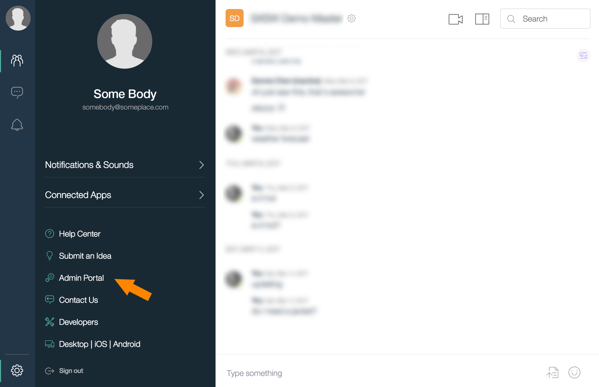
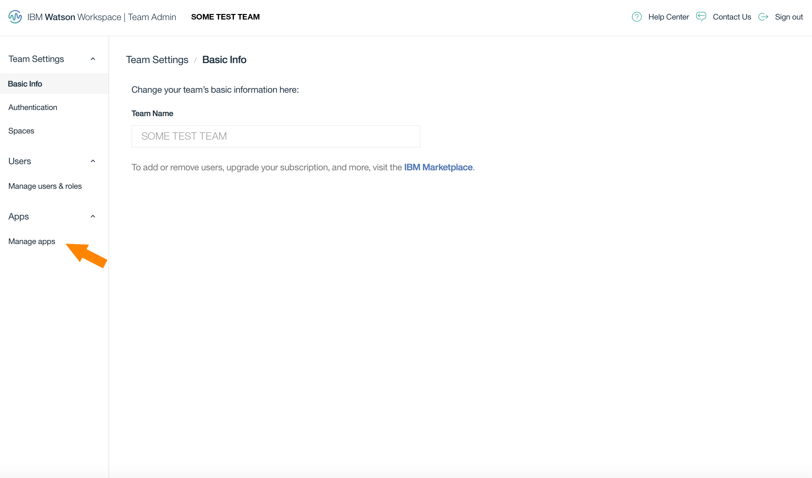
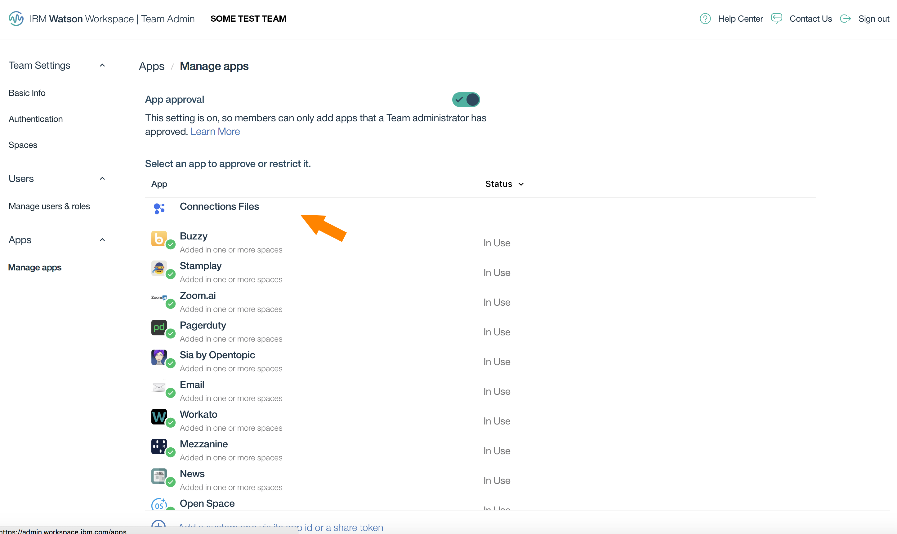
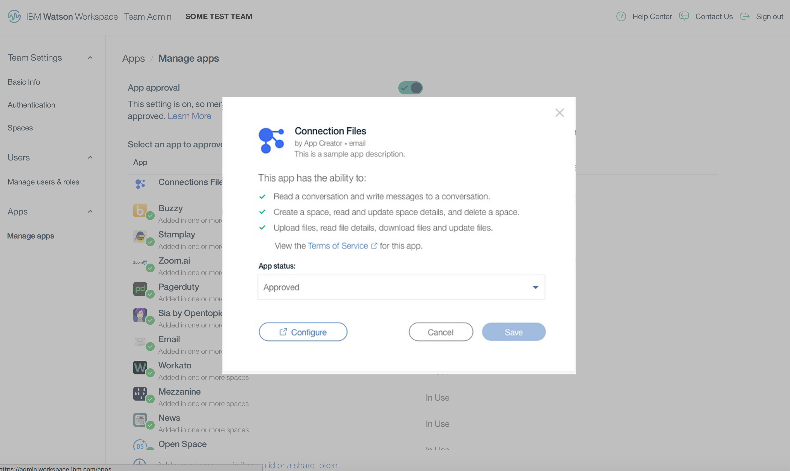

## Configuring an app

There are two possible configuration actions for your app, `space-app-config-requested` and `team-app-config-requested`,
both are **Explicit Actions**.
You can learn more about the concepts and basics of action handlers, by reading [Actions & Events](./V1_ActionsEvents.md).

## Configuring an app for a space

Having a space configuration can benefit your App in many ways. For example, a scheduling app might need calendar access.
Having the user’s authorization or credentials is essential for coordinating with third-party services.

Recognizing user-specific preferences can also enhance your App.  For example, the scheduling app can propose better meeting
times when user has already entered their preferred times.

You can even consider customizing your app differently for each space it’s been added to.

A user configuration can take place at two times:
 - when your App is added to a space
 - when a member of a space configures your App in that space

  
  
<strong>Note:</strong> All members of a space that have `space.app.configure` permission have access to configure an app in the space regardless of who added the app to the space.

### Implementing the space configuration page

First, you need to implement your space configuration page for your App. Read the
[Client Action Handler Callback API](./V1_AppActionCallback.md) for more information. Then follow the instructions above
to add your Client Action Handler URL. Also, you will need to use the [Get Action Context API](./V1_GetActionContext.md) to determine the context information that was passed via the [Client Action Handler Callback API](./V1_AppActionCallback.md) call.

## Configuring your app for a team

You can use Team Configuration to provide an administrator of a team with settings to customize your App for their team. For example, you can use this to allow an administrator to set a particular enterprise library for file sharing, that is unique to their team. This allows you to create a single App that can be built for a variety of teams, instead of having to make one-offs for each team you work with, giving you less work and giving your App broader appeal.

If your App registers a Client Action Handler URL for team configuration then a team administrator will see a Configure button when they enable your App for their team.

They will follow this flow...

1. Open up the settings panel in Workspace and select **Admin Portal**.

2. In the Admin Portal, select Manage Apps

3. Now seeing the list, Admin can select an app and...

4. ...and go through the team configuration experience

  
  
<strong>Note:</strong> Only people who have have `team.app.configure` permission have access to configure an app for an entire team.

### Implementing the team configuration page

First, you need to implement your team configuration page for your App. Read the
[Client Action Handler Callback API](./V1_AppActionCallback.md) for more information. Then follow the instructions above
to add your Client Action Handler URL. Also, you will need to use the [Get Action Context API](./V1_GetActionContext.md) to determine the context information that was passed via the [Client Action Handler Callback API](./V1_AppActionCallback.md) call.

